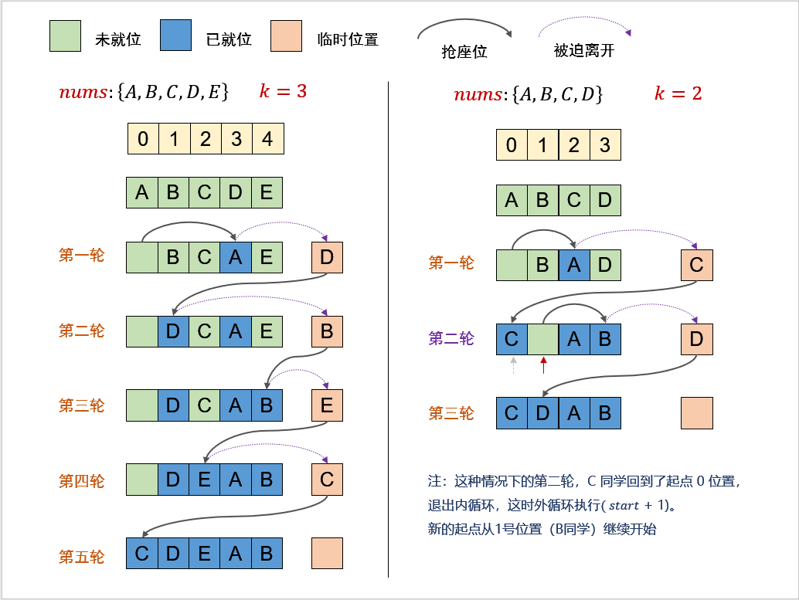

# 一维数组

# 数组的遍历

## 66. 加一

```go
func plusOne(digits []int) []int {
    n := len(digits)
    for i := n-1; i >= 0; i-- {
        if digits[i] != 9 {
            digits[i] += 1
            return digits
        }

        digits[i] = 0
    }

    res := make([]int, n+1)
    res[0] = 1
    return res
}
```

- 思路：
    - 尽可能不创建新数组，在原数组上移动
    - 模拟类型的题目，要先过一下具体的流程，找出规律再去想最佳解放

## **485. 最大连续 1 的个数**

> 思路1：寻找各个连续 1 的长度，返回最大值
> 

```go
func findMaxConsecutiveOnes(nums []int) int {
    var res int
    for i := 0; i < len(nums); i++ {
        if nums[i] == 1 {
            j := i
            for j < len(nums) {
                if nums[j] != 1 {
                    break
                }

                j++
            }
            res = max(res, j-i)
            i = j
        }
    }
    return res
}
```

- 时间复杂度是 O(n)
- 当遇到 1 时继续遍历，计算连续1区间的长度

> 思路2：一次遍历，在遍历过程中维护最大值
> 

```go
func findMaxConsecutiveOnes(nums []int) int {
    var cnt, res int
    for _, num := range nums {
        if num == 1 {
            cnt++
            if cnt > res {
                res = cnt
            }
        } else {
            cnt = 0
        }
    }
    return res
}
```

## 1512. 好数对的数目

```go
func numIdenticalPairs(nums []int) int {
    // 暴力求解
    var res int
    for i := 0; i < len(nums); i++ {
        for j := i+1; j < len(nums); j++ {
            if nums[j] == nums[i] {
                res++
            }
        }
    }
    return res
}
```

在暴力求解的函数中，采用了两层嵌套循环的方式来遍历整个数组 `nums`。

- 外层循环控制起始索引 `i`，从数组的开头开始，逐步向后移动。
- 内层循环则从 `i + 1` 开始，这样可以避免重复比较已经比较过的元素对（比如 `(nums[0], nums[1])` 和 `(nums[1], nums[0])` 只算一对）。
- 对于每一对元素 `nums[i]` 和 `nums[j]`（`j > i`），都去判断它们是否相等，如果相等，就意味着找到了一组满足条件的 “好数对”，此时将结果计数器 `res` 加 1。通过这样遍历完整个数组，最终 `res` 的值就是数组中 “好数对” 的数量。
- 这种暴力求解的方法时间复杂度是`O(n^2)`

```go
func numIdenticalPairs(nums []int) int {
    // 哈希表统计，等差数列求和
    numCnt := make(map[int]int, len(nums))
    var res int
    
    for i := 0; i < len(nums); i++ {
        numCnt[nums[i]]++
    }

    for _, cnt := range numCnt {
        res += cnt*(cnt-1)/2
    }

    return res
}
```

**暴力求解时存在大量重复的比较操作，为了避免这些重复操作，使用哈希表来统计每个数字在数组中出现的次数。**

<aside>
💡

可以先想想暴力求解的做法，然后再去考虑暴力求解的步骤中有哪些可以优化的地方

</aside>

- 好数对数量求法可以转化为等差数列，因为是数对，故而需要少统计一个数字，所以是 `(cnt-1)*cnt/2`
    
    <aside>
    💡
    
    等差数列公式：`n * (n+1) / 2`
    
    </aside>
    
    - 本题统计的是对数，对数由两个数字组成，因此用等差数列统计时，cnt 需要减 1，代入等差数列公式即得到代码里的公式
- 只遍历了一次，因此时间复杂度是`O(n)` ，但是我们使用了额外空间，即哈希表，因此空间复杂度是`O(n)`

## **1534. 统计好三元组**

暴力解法

```go
func countGoodTriplets(arr []int, a int, b int, c int) int {
    n, res := len(arr), 0
    for i := 0; i < n; i++ {
        for j := i+1; j < n; j++ {
            for k := j+1; k < n; k++ {
                if abs(arr[i], arr[j]) <= a &&
                    abs(arr[j], arr[k]) <= b &&
                    abs(arr[i], arr[k]) <= c {
                        res++
                    }
            }
        }
    }
    return res
}

func abs(a, b int) int {
    return int(math.Abs(float64(a - b)))
}
```

但是请注意，if 判断条件中 `abs(arr[i], arr[j]) <= a` 于 k 无关，因此我们可以将这个条件提到 第三个 for 循环外去判断，尽可能的减少循环次数

<aside>
💡

可以提前 if 进行条件判断，减少循环次数，对算法进行剪枝

</aside>

```go
func countGoodTriplets(arr []int, a int, b int, c int) int {
    n, res := len(arr), 0
    for i := 0; i < n; i++ {
        for j := i+1; j < n; j++ {
            if abs(arr[i], arr[j]) <= a {
                for k := j+1; k < n; k++ {
                    if abs(arr[j], arr[k]) <= b && abs(arr[i], arr[k]) <= c {
                        res++
                    }
                }
            }
        }
    }
    return res
}

func abs(a, b int) int {
    return int(math.Abs(float64(a - b)))
}
```

比起暴力快了 2ms（实际上可能每一次运行耗时都不一样 😂）

## **495. 提莫攻击**

涉及到数组遍历过程中的边界条件处理，本身属于非常基础的边界条件处理，没什么好细说的

```go
func findPoisonedDuration(timeSeries []int, duration int) int {
    var timeSum int
    for i := 0; i < len(timeSeries)-1; i++ {
        if timeSeries[i+1] - timeSeries[i] >= duration {
            timeSum += duration
        } else {
            timeSum += timeSeries[i+1]-timeSeries[i]
        }
    }
    return timeSum + duration
}
```

## **414. 第三大的数**

排序

```go
func thirdMax(nums []int) int {
    n := len(nums)
    if n == 1 {
        return nums[0]
    }

    // 排序
    sort.Slice(nums, func(i, j int) bool {
        return nums[i] > nums[j]
    })

    cnt := 1
    for i := 1; i < len(nums); i++ {
        if nums[i] != nums[i-1] {
            cnt++
        }

        if cnt == 3 {
            return nums[i]
        }
    }

    return nums[0]
}
```

一次遍历

```go
func thirdMax(nums []int) int {
    n := len(nums)
    if n == 1 {
        return nums[0]
    }

    // O(n) 一次遍历统计
    a, b, c := math.MinInt64, math.MinInt64, math.MinInt64
    for _, v := range nums {
        if v > a {
            a, b, c = v, a, b
        } else if a > v && v > b {
            b, c = v, b
        } else if b > v && v > c {
            c = v
        }
    }

    if c == math.MinInt64 {
        return a
    }
    return c
}
```

<aside>
💡

排序是最直观的，但是速度不是最快的，在一些简单的题目中，一般可以考虑下不排序如何实现

而在一些需要排好序才能使用更方便的算法的题目中（比如二分查找），适当的使用排序可以更好的解题（有时候计算复杂度时还可以忽略排序的复杂度）

</aside>

## **697. 数组的度**

```go
type entity struct {cnt, start, end int}

func findShortestSubArray(nums []int) int {
    cntMp := make(map[int]entity, len(nums))
    for i, v := range nums {
        if e, ok := cntMp[v]; ok {
            e.cnt++
            e.end = i
            cntMp[v] = e
        } else {
            cntMp[v] = entity{1, i, i}
        }
    }

    var maxCnt, res int
    for _, e := range cntMp {
        if e.cnt > maxCnt {
            maxCnt = e.cnt
            res = e.end - e.start + 1
        } else if e.cnt == maxCnt {
            res = min(res, e.end - e.start + 1)
        }
    }

    return res
}
```

<aside>
💡

1. 数组一般会和其他数据结构一起配合出现，这道题就与哈希表结合在一起解题
2. 适当的使用结构体来存储数据，在一次遍历的过程中就可以存储多个需要的数据了
</aside>

# 数组的旋转

## **189. 轮转数组**

比较经典的题目，有很多种解法

> 解法一：部分反转，再全部反转
> 

```go
func rotate(nums []int, k int)  {
    k %= len(nums)
    slices.Reverse(nums)
    slices.Reverse(nums[:k])
    slices.Reverse(nums[k:])
}
```

示例：

```python
原数组： [1, 2, 3, 4, 5, 6, 7]
全部反转：[7, 6, 5, | 4, 3, 2, 1]
										这里是轮转的位置
分开的两部分各自再反转回来: [5, 6, 7, 1, 2, 3, 4]
```

> 解法二：各自拷贝到新数组上
> 

```go
func rotate(nums []int, k int) {
		n := len(nums)
		k %= n
		p := n - k
		temp := make([]int, n)
		copy(temp, nums[p:])
		copy(temp[k:], nums[:p])
		copy(nums, temp)
}
```

当然，这里需要额外的空间，效率并不如解法一

> 解法三：循环交换
> 

```go
func rotate(nums []int, k int)  {
    n := len(nums)
    k %= n
    cnt := 0

    for i := 0; cnt < n; i++ {
        start, cur, tmp := i, i, nums[i]

        for {
            next := (cur + k) % n
            nums[next], tmp = tmp, nums[next]
            cnt++
            cur = next
            if cur == start {
                break
            }
        }
    }
}
```

这里就是将每个元素向后移动 k 位，通过逐个处理切片中的元素，将每个元素移动到旋转 `k` 步后对应的正确位置上，直到所有元素都被正确处理，从而实现整个切片的旋转效果

这里引用一下本题题解的图

https://leetcode.cn/problems/rotate-array/solutions/242188/xuan-zhuan-shu-zu-yuan-di-huan-wei-xiang-xi-tu-jie/

循环交换，可能会出现下图的两种情况



上图所示的第二种情况，可能在交换后，循环又回到了最初的起点，但是仍然有部分元素没有被交换，所以我们需要知道哪些还没被交换

首先获取切片 `nums` 的长度 `n`，然后通过对给定的旋转步数 `k` 取余操作（`k %= n`），来确定实际有效的旋转次数。因为如果 `k` 大于切片长度 `n`，经过整数倍长度的旋转后，相当于又回到了初始状态，所以取余后的 `k` 才是真正要进行的旋转偏移量。

使用一个外层 `for` 循环来控制整个旋转流程，循环的终止条件是已经处理完切片中的所有元素（通过计数器 `cnt` 与切片长度 `n` 比较来判断，当 `cnt < n` 时继续循环）。每次从一个新的起始位置 `i` 开始进行一组元素的旋转调整。

在外层循环内部，针对每一组需要旋转调整的元素：

- 记录起始位置 `start`、当前处理位置 `cur` 以及起始位置的元素值 `tmp`。
- 进入一个内层循环，通过不断根据旋转偏移量 `k` 来计算下一个要交换元素的位置（`next := (cur + k) % n`），然后交换当前位置和下一个位置的元素值（`nums[next], tmp = tmp, nums[next]`），同时更新计数器 `cnt` 和当前位置 `cur`。直到当前位置 `cur` 又回到了最开始的起始位置 `start`，意味着这一组元素按照要求旋转完毕，结束这一组的内层循环，然后外层循环继续寻找下一个起始位置进行下一组元素的旋转，直到整个切片的元素都完成旋转调整。

## **396. 旋转函数**

起初，我考虑不用实际换位，就能计算每一次旋转后的数组和是多少，试用 python 写出来

```python
# 注：这是错误答案
class Solution:
    def maxRotateFunction(self, nums: List[int]) -> int:
        return max([get_sum(nums, i) for i in range(len(nums))])

def get_sum(nums: List[int], offset: int) -> int:
    s = 0
    for i, v in enumerate(nums):
        s += v * ((i + offset) % len(nums))
    return s

```

但是，在遇到数组很长的时候，还是会超时，虽然我没有实际对数组实际换位，但是我的算法还是 `O(n²)`的

题目中列出了公式，我们尝试进行推导(假设数组的和为 numSum)

F(0) = 0 * nums[0] + 1 * nums[1] + …… + (n-1) * nums[n-1]

F(1) = 1 * nums[0] + 2 * nums[1] + …… + (n-1) * nums[n-2] + 0 * nums[n-1]

       = F(0) + numSum - n * nums[n-1]

F(2) = 2 * nums[0] + 3 * nums[1] + …… + 0 * nums[n-2] + 1 * nums[n-1]

= F(1) + numSum - n * nums[n-2]

可得到公式

F(x) = F(x-1) + numSum - n * nums[n-k]

由此，我们可以算出 F(0) 后，推导出不同的 x (0 ≤ x < len(nums)) 的值，并维护一个最大值

```python
func maxRotateFunction(nums []int) int {
    res, f, sum, n := 0, 0, 0, len(nums)
    for i, v := range nums {
        f += i * v
        sum += v
    }
    res = f

    for i := 1; i < n; i++ {
        fx := f + sum - n * nums[n-i]
        res = max(res, fx)
        f = fx
    }

    return res
}
```

# 原地换位

原地换位，也称为原地哈希。通常是在给定的数组上进行操作，通过哈希表的思想，将元素的关键值映射为一个确定的位置索引上，通过对元素的位置进行调整或标记，来达到某种特定的目的

这种思维**能够优化空间复杂度，但是要注意不要因为操作不当导致数据被覆盖**

## **645. 错误的集合**

```go
func findErrorNums(nums []int) []int {
    n := len(nums)
    for i := 0; i < n; i++ {
        for nums[i] != i+1 && nums[i] != nums[nums[i]-1] {
            nums[i], nums[nums[i]-1] = nums[nums[i]-1], nums[i]
        }
    }

    for i, v := range nums {
        if i + 1 != v {
            return []int{v, i+1}
        }
    }

    return nil
}
```

## **448. 找到所有数组中消失的数字**

> 解法一：交换数组中的元素
> 

```go
func findDisappearedNumbers(nums []int) []int {
    for i := range nums {
        for nums[nums[i]-1] != nums[i] {
            nums[i], nums[nums[i]-1] = nums[nums[i]-1], nums[i]
        }
    }

    res := make([]int, 0, len(nums))
    for i, v := range nums {
        if v != i+1 {
            res = append(res, i+1)
        }
    }
    return res
}
```

> 解法二：标记法
> 

```go
func findDisappearedNumbers(nums []int) []int {
    for _, v := range nums {
        if nums[Abs(v)-1] > 0 {
            nums[Abs(v)-1] *= -1
        }
    }

    var res []int
    for i, v := range nums {
        if v > 0 {
            res = append(res, i+1)
        }
    }

    return res
}

func Abs(num int) int {
    if num < 0 {
        return -num
    } else {
        return num
    }
}
```

## **442. 数组中重复的数据**

> 解法一：交换数组中的元素
> 

```go
func findDuplicates(nums []int) []int {
    for i, v := range nums {
        if v == i + 1 {
            continue
        }

        for nums[i] != nums[nums[i]-1] {
            nums[i], nums[nums[i]-1] = nums[nums[i]-1], nums[i]
        }
    }
    
    var res []int
    for i, v := range nums {
        if v != i + 1 {
            res = append(res, v)
        }
    }
    return res
}
```

> 解法二：标记法
> 

```go
func findDuplicates(nums []int) []int {
    var res []int
    for _, v := range nums {
        v = abs(v)
        if nums[v-1] < 0 {
            res = append(res, v)
        } else {
            nums[v-1] = -nums[v-1]
        }  
    }
    return res
}

func abs(a int) int {
    if a >= 0 {
        return a
    }
    return -a
}
```

## **41. 缺失的第一个正数**

```go
func firstMissingPositive(nums []int) int {
    n := len(nums)
    for i := 0; i < n; i++ {
        for nums[i] <= n && nums[i] > 0 && nums[i] != i+1 && nums[i] != nums[nums[i]-1] {
            nums[i], nums[nums[i]-1] = nums[nums[i]-1], nums[i]
        }
    }

    for i, v := range nums {
        if v != i+1 {
            return i+1
        }
    }

    return n+1
}
```

- 本题也是用不断的将元素放到对应索引的位置，然后重新遍历数组找到缺失的数字
- 难点在于代码：`for nums[i] <= n && nums[i] > 0 && nums[i] != i+1 && nums[i] != nums[nums[i]-1]` 的边界处理，我们逐个说明：
    - **`nums[i] <= n` 条件：**数组的长度为 `n` ，我们希望将 `1` 到 `n` 范围内的正整数放置到对应的正确位置上
    - **`nums[i] > 0` 条件**：题目要求找的是最小的正整数，所以负数和 `0` 都不在我们考虑进行位置调整的范围内，遇到负数或者 `0` 时，直接跳过该元素，不需要去交换它来尝试放置到所谓 “正确位置”
    - **`nums[i]!= i + 1` 条件**：如果 `nums[i]` 的值已经等于它 “理论上” 正确的位置所应该对应的值，那就说明该元素已经处于正确的位置了，不需要再对它进行交换等调整操作，可以直接跳过，继续处理下一个元素
    - **`nums[i]!= nums[nums[i] - 1]` 条件**：这个条件主要是为了避免无限循环交换的情况，确保交换是有效的。假设当前 `nums[i]` 的值为 `x` ，如果 `nums[x - 1]` 已经是 `x` 了（也就是要交换过去的目标位置上的元素已经是当前元素的值了），那就没必要再进行这次交换了，不然会陷入反复交换这两个相同值元素的死循环中

# 数组的移动

## **453. 最小操作次数使数组元素相等**

```go
func minMoves(nums []int) (ans int) {
    min := nums[0]
    for _, i := range nums[1:] {
        if i < min {
            min = i
        }
    }

    for _, i := range nums {
        ans += i - min
    }
    return
}
```

- 题目要求通过每次使 `n - 1` 个元素增加 `1` 的操作，让数组中所有元素最终相等，并且求出最小操作次数。
- 我们可以换个角度思考这个操作，每次使 `n - 1` 个元素增加 `1`，其实等同于每次让 1 个元素减少 `1`。
- 从而将问题转化为所有元素都变为最小元素需要的操作数

<aside>
💡

有些问题，正面难以求解的时候，需要使用逆向思维来找到解题的捷径

</aside>

## 665. 非递减数列

```go
func checkPossibility(nums []int) bool {
    if len(nums) <= 1 {
        return true
    }
    
    var down int
    for i := 0; i < len(nums)-1; i++ {
        if nums[i] > nums[i+1] {
            down = i
            break
        }
    }

    if down != 0 && nums[down-1] > nums[down+1] {
        nums[down+1] = nums[down]
    } else {
        nums[down] = nums[down+1]
    }

    for i := down; i < len(nums)-1; i++ {
        if nums[i] > nums[i+1] {
            return false
        }
    }
    return true
}
```

我的第一印象思考到简单的思路，最后出错了，思路是这样的：

1. 数组可能存在多个位置，使整个数列无法呈现非递减特性
2. 我们如果找到多处，说明我们无法通过一次操作将数列变为非递减数列
3. 如果只有一处，那么我们可以判定为可以通过一次操作，将数列调整为非递减数列
    1. 这个思路的第一印象，导致我第一次提交解答错误
    2. 也就是说，即使只有一处，经过调整也不一定能把数列变为非递减
    3. 举个例子 [5, 7, 3, 4],  5 → 7 是非递减的，3 → 4 也是非递减的，只有 7 → 3 这里一处是递减的，但是我们无法通过一次操作将整个数列变为非递减数列

<aside>
💡

1. 具备初步的思路固然值得认可，然而务必审慎考量边界条件
2. 针对此类题型，不妨构建二维平面坐标系并绘制折线图以辅助分析。借助图像化的呈现方式，能够更为直观地洞察各种潜在情形，进而更高效地梳理并确定边界条件
</aside>

因此，我们的初步思路需要改进，简而言之，我们需要调整数列中第一对递减数对，使他呈现非递减性，然后从此处开始继续遍历，看之后是否还存在递减的地方

我们操作递减元素的方式有两种（拐点 C 为当前元素）

下移前一个元素 B


上移当前元素 C


如何选择上移还是下移呢？

我们需要借助拐点 C 后面的元素 D 加以判断

1. 拐点前的元素 B 小于拐点后的元素 D，当前元素 C 需要上移


1. 拐点前的元素 B 大于拐点后的元素 D，拐点前的元素 B 需要下移


至于 BD 相等的情况，则以上两种移动方式都可以