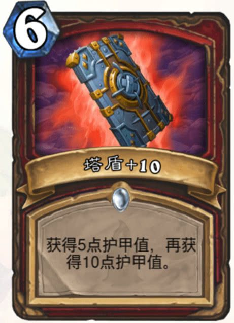
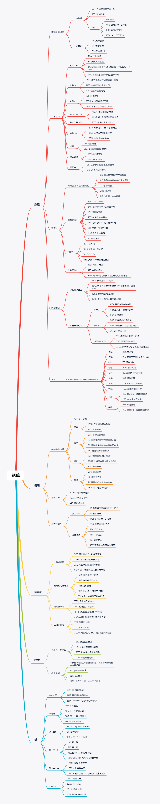

# Leetcode 数据结构与算法题解与题单随手记

# 开篇叠甲

1. 这个题单主要是我为了应对社招而建立的
2. 本质上是一份刷题的随笔，题解主要自己能看懂就行了（如果你没看懂可以留言，我会更新），所以没怎么注重文笔
   1. 题解：由于时间限制，一般不会重头到尾的解释，只会解释一些重要部分
   2. 标注(打了💡的地方)：会有一些标注，是我刷题冒出来的想法，或者做题的灵感
      1. 由于笔记在 notion 中导出来后，标注的框在 md 中没有对应的样式，所以仅剩下一个 💡 了......
   3. 吐槽：偶尔会对题目有点吐槽，比如我实在不想再做的题目......
3. 会带有一些数据结构与算法的概念解释，正常来说，可能用 AI 加以润色。是将自己理解的概念或特性重新输出一遍，以达到复习和巩固的效果。
4. 题单大部分参考自灵神的题单（https://leetcode.cn/u/endlesscheng/），也有一些来自算法通关手册（https://algo.itcharge.cn/），还有一些是自己找的
5. 由于懒得画图，有些图片会从 leetcode 题解中复制粘贴过来，会贴上原文链接（有一说一，一图胜千言）

# 目录

- [数组](https://github.com/namelyzz/LeetcodeSolution/blob/main/%E6%95%B0%E7%BB%84/%E6%95%B0%E7%BB%84%E9%A2%98%E5%8D%95.md)
  - [一维数组](https://github.com/namelyzz/LeetcodeSolution/blob/main/%E6%95%B0%E7%BB%84/%E4%B8%80%E7%BB%B4%E6%95%B0%E7%BB%84/%E4%B8%80%E7%BB%B4%E6%95%B0%E7%BB%84%20.md)

# 题单总览（更新中）

在刷了在刷了......

